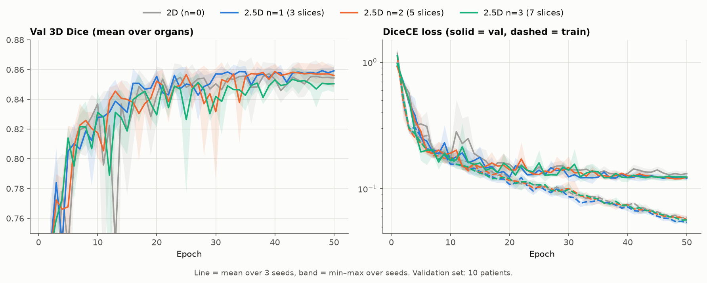
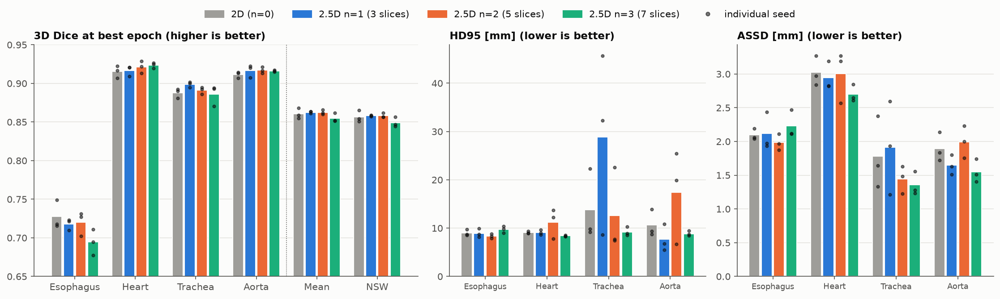
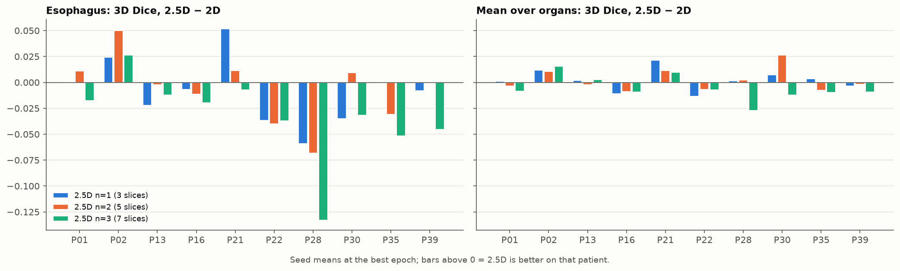
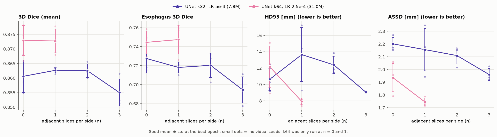

# 2.5D sweep: adjacent slices as input channels

Follow-up to the [architecture sweep](../arch_sweep/sweep_report.md), to check whether through-plane context helps the 2D UNet, in particular on the esophagus.

**Setup.** 4 configs × 3 seeds = 12 runs:
- `unet_k32_lr5e-4` from the architecture sweep, with n ∈ {0, 1, 2, 3} adjacent slices per side stacked as 2n + 1 input channels. n = 0 is the 2D baseline. The label is always the centre slice's.
- At volume edges the window is clamped: the edge slice is repeated, and a window never crosses patients.
- Same recipe as before: Adam, polynomial schedule, no weight decay, DiceCE, 50 epochs. The best epoch is selected on mean 3D Dice. HD95 and ASSD exist for the best epoch only.
- Only the first conv grows (7.8M params for every n). The LR was tuned for 2D and not retuned per n.
- **Follow-up runs:** `unet_k64_lr2.5e-4` (the best arch_sweep config, 31.0M) at n ∈ {0, 1} × 3 seeds = 6 runs, same recipe and split, to test for a model size × 2.5D interaction (§4) after`unet_k32_lr5e-4`was found to benefit little from 2.5D .

**Caveat.** This is the first sweep on the agreed 30/10 split, so the 2D baseline was rerun. Its numbers (0.861) are **not** comparable with the 35/5 sweeps (0.848 for the same config). With 10 val patients the noise is lower than before, but treat Dice gaps under about 0.005 as noise.

Regenerate: `python plotting/plot_adj_sweep.py` from the repo root.

## Summary

| Config | Slices | 3D Dice | Eso. | HD95 mm | ASSD mm | Min/ep. |
|---|---|---|---|---|---|---|
| `unet_k32_lr5e-4_adj0` (2D) | 1 | 0.861 ± 0.006 | **0.727 ± 0.015** | 10.6 ± 1.4 | 2.20 ± 0.05 | 5.0 |
| `unet_k32_lr5e-4_adj1` | 3 | **0.863 ± 0.001** | 0.718 ± 0.006 | 13.6 ± 3.3 | 2.16 ± 0.17 | 5.3 |
| `unet_k32_lr5e-4_adj2` | 5 | 0.863 ± 0.002 | 0.720 ± 0.013 | 12.4 ± 1.0 | 2.11 ± 0.07 | 5.6 |
| `unet_k32_lr5e-4_adj3` | 7 | 0.855 ± 0.005 | 0.695 ± 0.014 | 9.1 ± 0.1 | 1.96 ± 0.05 | 6.0 |
| `unet_k64_lr2.5e-4_adj0` (2D) | 1 | **0.873 ± 0.005** | 0.745 ± 0.012 | 12.2 ± 2.5 | 1.94 ± 0.11 | 3.1 † |
| `unet_k64_lr2.5e-4_adj1` | 3 | 0.873 ± 0.004 | **0.747 ± 0.015** | **7.9 ± 0.4** | **1.74 ± 0.03** | 3.0 † |

† A100; the k32 runs used MIG slices, so times are only comparable within a model size.

- **Model size matters more than 2.5D.** k64 beats k32 by +0.012 at both n = 0 and n = 1.
- **2.5D does not improve Dice.** n = 1 and n = 2 are +0.002 over 2D (noise); n = 3 is −0.006.
- **It does not help the esophagus.** Esophagus Dice drops for every n, by −0.032 at n = 3, where 9 of 10 patients get worse.
- **More context gives cleaner boundaries at n = 3.** n = 3 has the lowest HD95 and ASSD, and no stray blobs in any seed: HD95 ≤ 10.4 mm for every organ and seed.
- **Cost grows with n:** +20% time per epoch at n = 3.
- **No size × 2.5D interaction on Dice:** going from 2D to n = 1 changes Dice by +0.002 for k32 and 0.000 for k64.
-  **There is some interaction on distance metrics:** k64 at n = 1 has the best HD95 (7.9 mm) and ASSD (1.74 mm) of all six configs, with no stray blobs, which k32 needed n = 3 for.

## Findings

### 1. Metrics over epochs

- **Val loss is slightly lower with 2.5D** (final 0.121–0.124 vs 0.131 for 2D), but this does not show up in Dice.
- **2.5D is more consistent across seeds at n = 1–2** (std 0.001–0.002 vs 0.006 for 2D). Over the last 10 epochs, mean Dice is 0.853 (2D), 0.857 (n = 1, 2) and 0.851 (n = 3).
- **The plots mostly overlap.**

### 2. Per organ at best epoch

- **Heart, trachea and aorta are flat** (within about ±0.01 of 2D for every n). The trachea's best is n = 1 (+0.011).
- **Esophagus:** 0.727 (2D) → 0.718 / 0.720 / 0.695.
- **HD95 is still driven by stray blobs** (see the architecture sweep, §3). At n = 1, two seeds have a trachea blob (46 and 32 mm), which explains n = 1's 13.6 mm. At n = 3 no seed has one.
- **ASSD falls steadily with n** (2.20 → 1.96 mm), mostly on trachea (1.78 → 1.36) and aorta (1.90 → 1.55).

### 3. Per patient

| Config | Patients better (mean over organs) | Patients better (esophagus) | Worst esophagus Δ |
|---|---|---|---|
| `adj1` | 7/10 | 2/10 | P28 −0.059 |
| `adj2` | 4/10 | 4/10 | P28 −0.068 |
| `adj3` | 3/10 | 1/10 | P28 −0.133 |

- **No patient benefits consistently** except P02 and P21, which gain at every n (+0.01 to +0.02 mean).
- **P28 is the main loss on the esophagus**, and the drop grows with n. P22 and P28 were already the hardest patients in the earlier sweeps.

### 4. Model size × 2.5D (k64 follow-up)

| Δ from 2D to n = 1 | 3D Dice | Eso. | Trach. | Aorta | HD95 mm | ASSD mm | Patients better (mean / eso.) |
|---|---|---|---|---|---|---|---|
| k32 | +0.002 | −0.009 | +0.011 | +0.005 | +3.0 | −0.04 | 7/10 / 2/10 |
| k64 | 0.000 | +0.003 | +0.008 | −0.011 | −4.3 | −0.20 | 6/10 / 6/10 |

- **Dice: no interaction.** The difference in differences is −0.002, well within seed std (0.004–0.006).
- **Esophagus:** k64 does not lose the esophagus at n = 1 as k32 does. This is a hint at most: it is smaller than the seed std (0.015).
- **Aorta drops at k64 n = 1** (0.928 → 0.917, consistent over seeds), offsetting the trachea gain.
- **Distance metrics** For k64, n = 1 removes the stray blobs: max HD95 over organs and seeds goes from 25 mm (trachea and aorta at 2D) to 9.7 mm, and seed std falls from 2.5 to 0.4 mm. ASSD drops most on trachea (1.72 → 1.12 mm). For k32, n = 1 made HD95 worse (a 46 mm trachea blob).
- **Free on A100:** 3.0 vs 3.1 min per epoch; the extra input channels cost nothing measurable.

## Takeaway

1. **Use `unet_k64_lr2.5e-4` with `adjacent_slices = 1` as the main model.** Same Dice as k64 2D, but the best and most stable boundary metrics, at no extra cost.

## All configs

Mean ± std over 3 seeds at the best epoch. Bold = best in column. "Best ep." is per seed, 1-indexed. "Min/ep." is wall-clock minutes per epoch, including validation. The k32 runs used the `gpu_mig` partition and the k64 runs `gpu_a100`, so times are only comparable within a model size and not with the earlier sweeps.

| Config | Params | 3D Dice | 3D NSW | Eso. | Heart | Trach. | Aorta | 2D Dice | HD95 mm | ASSD mm | Best ep. | Min/ep. |
|---|---|---|---|---|---|---|---|---|---|---|---|---|
| `unet_k32_lr5e-4_adj0` | 7.8M | 0.861 ± 0.006 | 0.857 ± 0.006 | 0.727 ± 0.015 | 0.915 ± 0.006 | 0.888 ± 0.005 | 0.912 ± 0.003 | 0.920 ± 0.002 | 10.6 ± 1.4 | 2.20 ± 0.05 | 36/31/39 | 5.0 |
| `unet_k32_lr5e-4_adj1` | 7.8M | 0.863 ± 0.001 | 0.858 ± 0.001 | 0.718 ± 0.006 | 0.917 ± 0.005 | **0.899 ± 0.003** | 0.917 ± 0.007 | 0.925 ± 0.001 | 13.6 ± 3.3 | 2.16 ± 0.17 | 24/41/33 | 5.3 |
| `unet_k32_lr5e-4_adj2` | 7.8M | 0.863 ± 0.002 | 0.858 ± 0.003 | 0.720 ± 0.013 | 0.921 ± 0.006 | 0.891 ± 0.004 | 0.917 ± 0.003 | 0.920 ± 0.001 | 12.4 ± 1.0 | 2.11 ± 0.07 | 21/37/43 | 5.6 |
| `unet_k32_lr5e-4_adj3` | 7.8M | 0.855 ± 0.005 | 0.849 ± 0.005 | 0.695 ± 0.014 | 0.923 ± 0.003 | 0.886 ± 0.011 | 0.916 ± 0.001 | 0.920 ± 0.001 | 9.1 ± 0.1 | 1.96 ± 0.05 | 44/44/37 | 6.0 |
| `unet_k64_lr2.5e-4_adj0` | 31.0M | **0.873 ± 0.005** | 0.869 ± 0.006 | 0.745 ± 0.012 | **0.928 ± 0.005** | 0.891 ± 0.001 | **0.928 ± 0.003** | **0.929 ± 0.003** | 12.2 ± 2.5 | 1.94 ± 0.11 | 37/50/37 | 3.1 |
| `unet_k64_lr2.5e-4_adj1` | 31.0M | 0.873 ± 0.004 | **0.869 ± 0.005** | **0.747 ± 0.015** | 0.928 ± 0.003 | 0.899 ± 0.007 | 0.917 ± 0.003 | 0.928 ± 0.002 | **7.9 ± 0.4** | **1.74 ± 0.03** | 28/34/47 | 3.0 |
