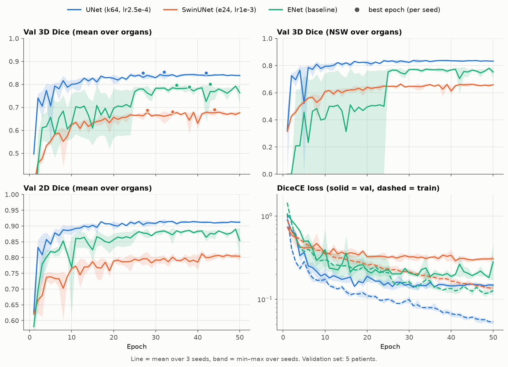
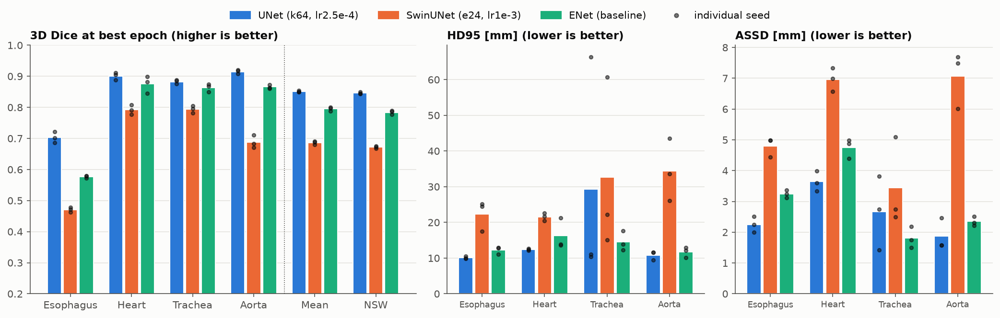
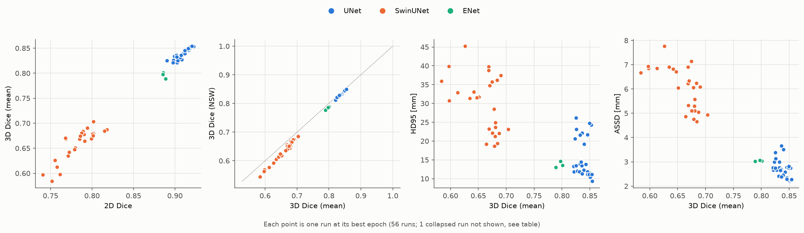
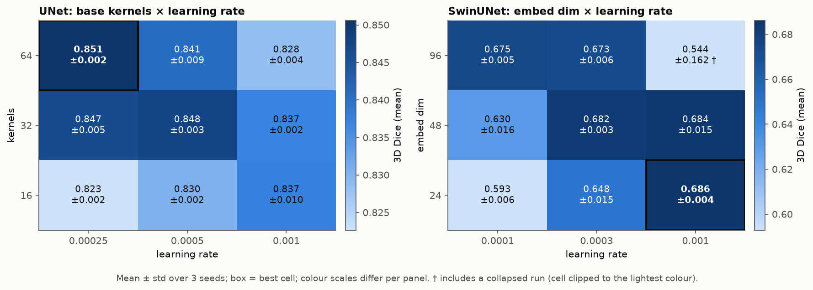
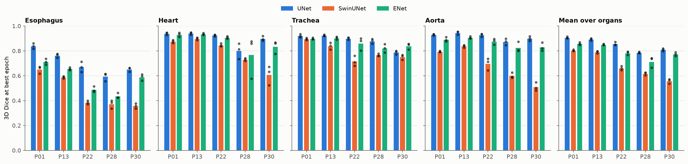
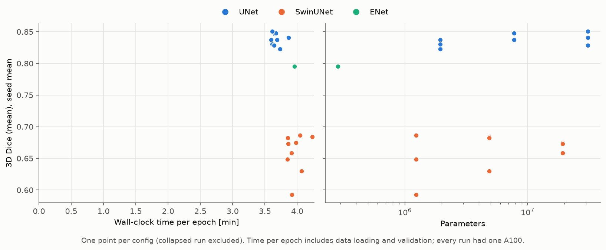
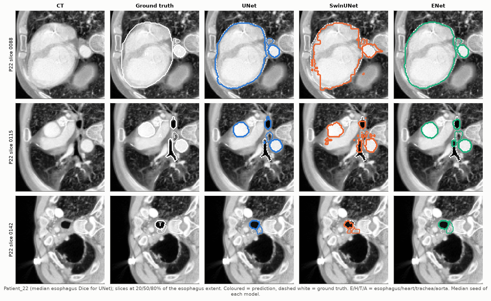

# Architecture sweep: UNet vs SwinUNet vs ENet

**Setup.** 19 configs × 3 seeds = 57 runs: UNet (kernels × LR), SwinUNet (embed dim × LR) and the ENet baseline. All runs use DiceCE, 50 epochs and 2D slices. The best epoch is selected on mean 3D Dice. HD95 and ASSD exist for the best epoch only due to compute constraints.

The recipe differs per architecture:
- **UNet:** Adam with a polynomial schedule, no weight decay.
- **SwinUNet:** AdamW with a polynomial schedule, weight decay 1e-2.
- **ENet baseline:** Adam at a constant LR of 5e-4, untuned, width k8 (0.28M).

**Caveat.** Due to an oversight, the sweep ran using a 35/5 train-val split, not the 30/10 split the team agreed on. Future experimetns should be ran on the 30/10 split as planned initially. Test set will be used for final eval only, so the val set was used to select both the best epoch and the best config.   
  
Treat the numbers as optimistic, and treat Dice gaps under about 0.01 as noise. In this sweep, the ENet was only ran according to the default parameters, with a fixed learning rate and size. The later [ENet sweep](../enet_sweep/enet_report.md) investigates how the ENet does when parameter-matched with the UNet.

Regenerate: `python plotting/plot_arch_sweep.py` from the repo root.

## Summary

| Config | Params | 3D Dice | 3D NSW | Eso. | Heart | Trach. | Aorta | 2D Dice | HD95 mm | ASSD mm | Best ep. | Min/ep. |
|---|---|---|---|---|---|---|---|---|---|---|---|---|
| `unet_k64_lr2.5e-4` | 31.0M | **0.851 ± 0.002** | **0.846 ± 0.003** | **0.704 ± 0.015** | **0.901 ± 0.010** | **0.882 ± 0.005** | **0.915 ± 0.005** | **0.919 ± 0.003** | 15.7 ± 6.4 | **2.61 ± 0.26** | 42/32/27 | 3.6 |
| `swin_e24_lr1e-3` | 1.2M | 0.686 ± 0.004 | 0.672 ± 0.003 | 0.471 ± 0.006 | 0.792 ± 0.012 | 0.794 ± 0.010 | 0.688 ± 0.017 | 0.804 ± 0.010 | 27.7 ± 6.9 | 5.57 ± 0.42 | 34/44/28 | 4.0 |
| `enet_baseline` | 0.3M | 0.796 ± 0.005 | 0.784 ± 0.005 | 0.577 ± 0.004 | 0.875 ± 0.022 | 0.864 ± 0.010 | 0.866 ± 0.005 | 0.887 ± 0.001 | **13.7 ± 0.7** | 3.04 ± 0.02 | 43/38/35 | 4.0 |

- **UNet > ENet > SwinUNet**, for every organ and for 19 of the 20 patient × organ pairs. **Update:** at matched size and the same recipe, the UNet–ENet gap shrinks from 0.055 to about 0.02, nearly all of it on esophagus ([ENet sweep](../enet_sweep/enet_report.md)).
- **SwinUNet is underfitting.** It does worse than ENet in every config, its best LR is at the edge of the grid, and it is still improving at epoch 50.
- **The esophagus is the bottleneck** for every model. Mean and NSW Dice give the same winners.
- **The top three UNet configs are tied** (within 0.004). k32 gets there with 4× fewer parameters than k64.
- **HD95 is driven by stray blobs** and barely correlates with Dice within UNet.

## Findings

### 1. Metrics over epochs

- **UNet** plateaus around epoch 15. Train loss keeps falling while val loss stays flat, and Dice doesn't drop.
- **SwinUNet** train and val loss stay level, and val Dice is still rising at epoch 50.
- **ENet:** every seed predicts nothing for at least one organ (always including the esophagus) until epochs 6–24. That puts NSW at 0 early on.

### 2. Per organ at best epoch

- UNet's lead over ENet is largest on the esophagus (+0.13). Swin's worst organ relative to the others is the aorta (0.69).
- UNet's trachea HD95 is high because of a single 271 mm stray blob (seed 2, P22). ENet has the most stable HD95.

### 3. Metric agreement

Spearman ρ across configs; the last column shows which config each metric would select:

| Architecture | n configs | ρ(3D, NSW) | ρ(3D, 2D) | ρ(3D, −HD95) | ρ(3D, −ASSD) | Winner by 3D / NSW / 2D / HD95 / ASSD |
|---|---|---|---|---|---|---|
| UNet | 9 | 0.98 | 0.95 | 0.15 | 0.47 | k64_lr2.5e-4 / k64_lr2.5e-4 / k64_lr2.5e-4 / k32_lr1e-3 / k32_lr5e-4 |
| SwinUNet | 9 | 1.00 | 0.92 | 0.78 | 0.77 | e24_lr1e-3 / e24_lr1e-3 / e24_lr1e-3 / e96_lr3e-4 / e96_lr3e-4 |

- The Dice variants agree. Choosing by 2D, 3D or NSW Dice gives the same winner.
- UNet HD95 is bimodal (about 12 vs about 22 mm), depending on whether a run produces a stray blob. Some post-processing should fix most of this.

### 4. Hyperparameter grids

- **UNet:** all configs are within 0.03 of each other, and larger models prefer lower LR. k64's best LR (2.5e-4) is the lowest in the grid.
- **Swin:** best at LR 1e-3, the top of the grid. e96 at 1e-3 is unstable: one seed collapsed (†).
- **e96 at 1e-3 collapse:** seed 2 collapsed to all-background in epoch 4 and never recovered: val Dice was 0 for every organ from epoch 5 on, with no NaNs. The other two seeds also had organs drop to 0 temporarily. `main.py` has no warmup or gradient clipping, adding it could potentially fix the issue.

### 5. Per patient

- P22 and P28 are hard for all models (esophagus 0.37–0.67).
- Swin's aorta failures are concentrated in P22, P28 and P30, so they are specific to Swin.
- With n = 5, a single patient shifts the mean by 0.02–0.05.

### 6. Cost vs accuracy

- Takeaway is that more parameters buys little: UNet k16 (1.9M) beats the ENet baseline, and Swin is flat from 1.2M to 19M. Wider ENets do gain (0.80 → 0.83 by 6.9M; see the ENet sweep).
- Time doesn't separate the models: every config takes 3.6–4.2 min per epoch (a 50-epoch run is about 3 h on one A100). Data loading and validation dominate.

### 7. Qualitative (P22, median seed per model)

- UNet and ENet follow the ground truth closely.
- Swin's boundaries are blocky (patch size) and it produces scattered false positives.
- Where the esophagus touches the trachea, all three models struggle.

## Next steps

1. Drop SwinUNet, likely not enough data; could try to lower learning rate and increase epochs but that's expensive and there's no guarantee it'd beat the other two.
2. UNet: could run k64 at LR 1e-4 to check for improvement.
3. Add post-processing and re-measure HD95.

## All configs

Mean ± std over 3 seeds at the best epoch. Bold = best in column. "Best ep." is per seed, 1-indexed. "Min/ep." is wall-clock minutes per epoch, including validation.

| Config | Params | 3D Dice | 3D NSW | Eso. | Heart | Trach. | Aorta | 2D Dice | HD95 mm | ASSD mm | Best ep. | Min/ep. |
|---|---|---|---|---|---|---|---|---|---|---|---|---|
| `unet_k64_lr2.5e-4` | 31.0M | **0.851 ± 0.002** | **0.846 ± 0.003** | **0.704 ± 0.015** | 0.901 ± 0.010 | 0.882 ± 0.005 | 0.915 ± 0.005 | **0.919 ± 0.003** | 15.7 ± 6.4 | 2.61 ± 0.26 | 42/32/27 | 3.6 |
| `unet_k32_lr5e-4` | 7.8M | 0.848 ± 0.003 | 0.842 ± 0.003 | 0.692 ± 0.002 | **0.911 ± 0.003** | 0.877 ± 0.014 | 0.910 ± 0.001 | 0.914 ± 0.003 | 15.7 ± 6.1 | **2.46 ± 0.21** | 42/21/33 | 3.7 |
| `unet_k32_lr2.5e-4` | 7.8M | 0.847 ± 0.005 | 0.840 ± 0.006 | 0.679 ± 0.012 | 0.900 ± 0.009 | **0.891 ± 0.002** | **0.916 ± 0.002** | 0.916 ± 0.003 | 13.7 ± 3.9 | 2.65 ± 0.60 | 33/25/44 | 3.7 |
| `unet_k64_lr5e-4` | 31.0M | 0.841 ± 0.009 | 0.837 ± 0.010 | 0.701 ± 0.012 | 0.884 ± 0.009 | 0.873 ± 0.009 | 0.905 ± 0.011 | 0.908 ± 0.009 | 17.7 ± 5.9 | 2.98 ± 0.57 | 37/44/42 | 3.9 |
| `unet_k16_lr1e-3` | 1.9M | 0.837 ± 0.010 | 0.831 ± 0.010 | 0.670 ± 0.020 | 0.900 ± 0.010 | 0.873 ± 0.013 | 0.908 ± 0.012 | 0.911 ± 0.005 | 18.7 ± 3.5 | 2.79 ± 0.17 | 30/45/37 | 3.6 |
| `unet_k32_lr1e-3` | 7.8M | 0.837 ± 0.002 | 0.831 ± 0.002 | 0.670 ± 0.006 | 0.904 ± 0.003 | 0.876 ± 0.008 | 0.898 ± 0.010 | 0.906 ± 0.004 | **12.4 ± 0.9** | 2.51 ± 0.13 | 21/39/31 | 3.7 |
| `unet_k16_lr5e-4` | 1.9M | 0.830 ± 0.002 | 0.823 ± 0.001 | 0.644 ± 0.007 | 0.900 ± 0.006 | 0.877 ± 0.003 | 0.900 ± 0.014 | 0.905 ± 0.003 | 12.6 ± 0.9 | 2.61 ± 0.15 | 37/35/22 | 3.6 |
| `unet_k64_lr1e-3` | 31.0M | 0.828 ± 0.004 | 0.823 ± 0.003 | 0.679 ± 0.013 | 0.894 ± 0.014 | 0.871 ± 0.009 | 0.870 ± 0.028 | 0.898 ± 0.005 | 18.0 ± 5.8 | 2.93 ± 0.33 | 37/37/35 | 3.6 |
| `unet_k16_lr2.5e-4` | 1.9M | 0.823 ± 0.002 | 0.814 ± 0.003 | 0.629 ± 0.007 | 0.902 ± 0.007 | 0.863 ± 0.012 | 0.897 ± 0.008 | 0.899 ± 0.002 | 16.1 ± 5.0 | 2.85 ± 0.21 | 21/31/22 | 3.7 |
| `swin_e24_lr1e-3` | 1.2M | 0.686 ± 0.004 | 0.672 ± 0.003 | 0.471 ± 0.006 | 0.792 ± 0.012 | 0.794 ± 0.010 | 0.688 ± 0.017 | 0.804 ± 0.010 | 27.7 ± 6.9 | 5.57 ± 0.42 | 34/44/28 | 4.0 |
| `swin_e48_lr1e-3` | 4.9M | 0.684 ± 0.015 | 0.666 ± 0.013 | 0.449 ± 0.020 | 0.816 ± 0.016 | 0.773 ± 0.038 | 0.698 ± 0.012 | 0.796 ± 0.008 | 27.7 ± 7.9 | 5.49 ± 0.54 | 45/46/49 | 4.2 |
| `swin_e48_lr3e-4` | 4.9M | 0.682 ± 0.003 | 0.658 ± 0.009 | 0.414 ± 0.034 | 0.832 ± 0.009 | 0.778 ± 0.006 | 0.705 ± 0.015 | 0.798 ± 0.012 | 28.0 ± 6.9 | 5.65 ± 0.70 | 31/46/31 | 3.9 |
| `swin_e96_lr1e-4` | 19.3M | 0.675 ± 0.005 | 0.648 ± 0.005 | 0.390 ± 0.011 | 0.831 ± 0.014 | 0.792 ± 0.013 | 0.687 ± 0.010 | 0.791 ± 0.006 | 28.0 ± 5.6 | 5.85 ± 0.91 | 29/27/29 | 4.0 |
| `swin_e96_lr3e-4` | 19.3M | 0.673 ± 0.006 | 0.647 ± 0.008 | 0.396 ± 0.017 | 0.824 ± 0.016 | 0.779 ± 0.009 | 0.693 ± 0.020 | 0.798 ± 0.005 | 20.0 ± 1.5 | 4.91 ± 0.15 | 42/48/43 | 3.9 |
| `swin_e24_lr3e-4` | 1.2M | 0.648 ± 0.015 | 0.621 ± 0.017 | 0.372 ± 0.022 | 0.812 ± 0.017 | 0.751 ± 0.010 | 0.659 ± 0.016 | 0.771 ± 0.002 | 34.7 ± 3.6 | 6.88 ± 0.04 | 36/27/22 | 3.9 |
| `swin_e48_lr1e-4` | 4.9M | 0.630 ± 0.016 | 0.596 ± 0.017 | 0.327 ± 0.011 | 0.803 ± 0.012 | 0.743 ± 0.020 | 0.646 ± 0.033 | 0.764 ± 0.011 | 36.6 ± 6.1 | 6.88 ± 0.70 | 24/36/34 | 4.1 |
| `swin_e24_lr1e-4` | 1.2M | 0.593 ± 0.006 | 0.559 ± 0.011 | 0.303 ± 0.021 | 0.785 ± 0.020 | 0.683 ± 0.025 | 0.600 ± 0.003 | 0.751 ± 0.008 | 35.5 ± 3.7 | 6.82 ± 0.11 | 31/24/25 | 3.9 |
| `swin_e96_lr1e-3` † | 19.3M | 0.544 ± 0.162 | 0.510 ± 0.180 | 0.304 ± 0.145 | 0.750 ± 0.085 | 0.603 ± 0.196 | 0.520 ± 0.222 | 0.729 ± 0.063 | 42.7 ± 13.5 | 9.61 ± 4.37 | 42/49/2 | 3.9 |
| `enet_baseline` | 0.3M | 0.796 ± 0.005 | 0.784 ± 0.005 | 0.577 ± 0.004 | 0.875 ± 0.022 | 0.864 ± 0.010 | 0.866 ± 0.005 | 0.887 ± 0.001 | 13.7 ± 0.7 | 3.04 ± 0.02 | 43/38/35 | 4.0 |

† Seed 2 collapsed to all-background in epoch 4; its best epoch is 2, with Dice 0.32 (details in §4). It is counted in this row's mean ± std and excluded from best-config selection and figures 3 and 6.
