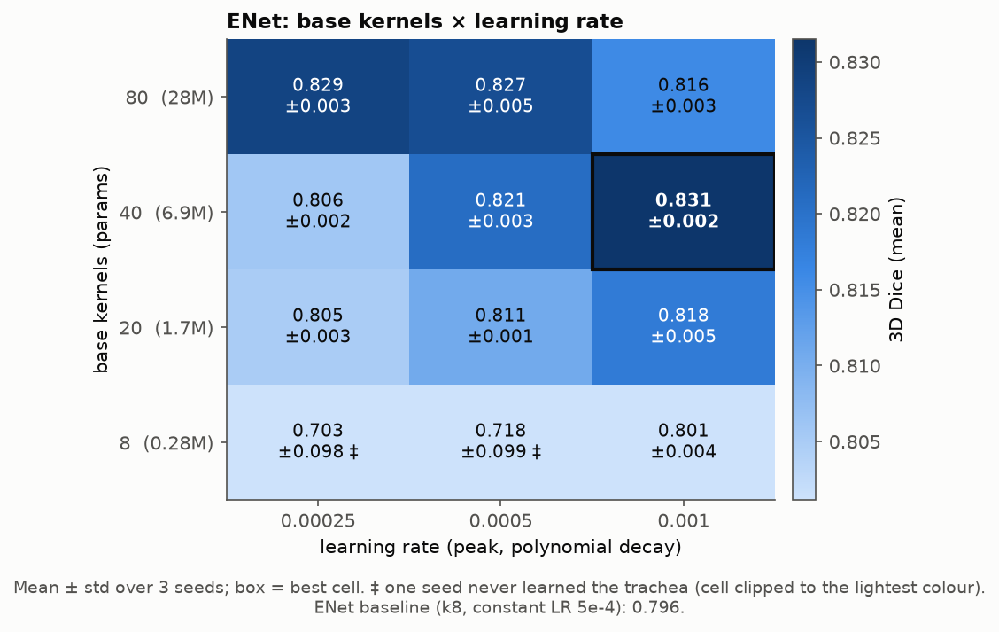
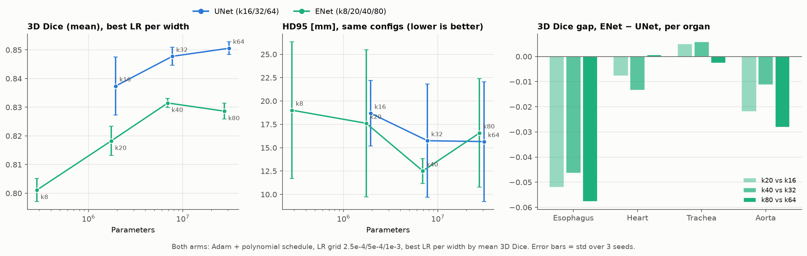
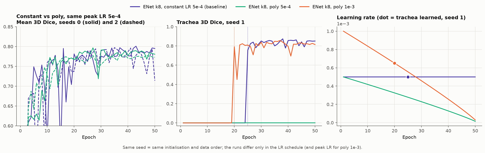

# ENet sweep: width × LR at UNet scale

Follow-up to the [architecture sweep](../arch_sweep/sweep_report.md), to check if the UNet–ENet gap that was found (0.055 3D Dice) comes from the architecture, from model size, or from the training recipe.

**Setup.** 12 configs × 3 seeds = 36 runs:
- ENet widths k ∈ {8, 20, 40, 80} × LR ∈ {2.5e-4, 5e-4, 1e-3}, projection factor 2.
- The recipe is the UNet arm's: Adam, polynomial schedule, no weight decay, DiceCE, 50 epochs.
- k20/40/80 are within about 15% of the parameter counts of UNet k16/32/64. k8 is the baseline's width.
- `enet_k8_lr5e-4` differs from `enet_baseline` only in the schedule: same seeds, same initialisation (identical first-batch loss).

**Caveat.** This sweep ran on the 35/5 split as before, so that the results are comparable to the previous architecture sweep. Treat gaps under about 0.01 as noise.

Regenerate: `python plotting/plot_enet_sweep.py` from the repo root.

## Summary

| Scale | UNet | 3D Dice | ENet | 3D Dice | Δ |
|---|---|---|---|---|---|
| ~2M | `unet_k16_lr1e-3` | 0.837 ± 0.010 | `enet_k20_lr1e-3` | 0.818 ± 0.005 | −0.019 |
| ~7M | `unet_k32_lr5e-4` | 0.848 ± 0.003 | `enet_k40_lr1e-3` | **0.831 ± 0.002** | −0.016 |
| ~30M | `unet_k64_lr2.5e-4` | **0.851 ± 0.002** | `enet_k80_lr2.5e-4` | 0.829 ± 0.003 | −0.022 |

- **At matched scale and recipe, ENet trails UNet by about 0.02, not 0.055.** The rest of the original gap came from size and tuning.
- **The remaining gap is almost all esophagus** (−0.05). Heart and trachea are level. On HD95, ENet is as good or better.
- **ENet width helps up to k40 (6.9M), then plateaus.** As with UNet, larger models prefer a lower LR.
- **The polynomial schedule can lock in a dead class in small ENets.** At k8, seed 1 never learned the trachea with poly at 5e-4 or 2.5e-4. With a constant LR, the same initialisation recovered at epoch 25.
- **Otherwise the schedule mostly smooths training:** late-epoch noise falls 3-4x, with similar peak Dice.

## Findings

### 1. Width × LR grid

- **Width:** the best Dice per width rises from 0.801 (k8) to 0.818 (k20) and 0.831 (k40), then holds at 0.829 (k80).
- **Best LR moves down as width grows:** 1e-3 for k8–k40, 2.5e-4 for k80. Up to k40 the best LR is at the top of the grid, so those widths may be slightly under-tuned.
- **Seeds agree:** std is ≤ 0.005 everywhere except the two ‡ cells, against up to 0.010 for UNet.

### 2. ENet vs UNet at matched scale

- **The gap is the same at every scale** (0.016–0.022), pointing to a property of the architecture, not size. ENet does not catch up at larger widths.
- **Per organ:** esophagus −0.05, aorta −0.01 to −0.03, heart and trachea within ±0.015.
- **HD95 is noisy for both** (stray blobs; see the original report §3). The best ENet, k40, has 12.5 mm against 15.7 mm for both UNet k32 and k64.
- **Compute is similar:** at each scale, ENet costs about 1.1× UNet's GMACs and 2.3× its activations, and wall-clock time is about the same (3.6–4.0 min per epoch, about 3 h per run).

### 3. Polynomial schedule vs constant LR (k8)

The left panel compares constant LR with the polynomial schedule at the same peak LR (5e-4), so the only difference is the decay. Seed 1 is shown separately in the middle and right panels because there poly 5e-4 never learns the trachea; poly 1e-3 is added to show that the same decay still learns the trachea when the LR stays high enough, so the problem is the low LR, not the decay itself.

| Config | Schedule | Seed 0 | Seed 1 | Seed 2 | Trachea learned (epoch) | Late noise | Best − final |
|---|---|---|---|---|---|---|---|
| `enet_baseline` | constant 5e-4 | 0.801 | 0.789 | 0.797 | 2 / 25 / 2 | 0.021 | 0.032 |
| `enet_k8_lr5e-4` | poly 5e-4 | 0.797 | 0.579 | 0.780 | 3 / never / 2 | 0.005 | 0.011 |
| `enet_k8_lr2.5e-4` | poly 2.5e-4 | 0.773 | 0.565 | 0.771 | 4 / never / 5 | 0.008 | 0.011 |
| `enet_k8_lr1e-3` | poly 1e-3 | 0.806 | 0.796 | 0.802 | 2 / 20 / 2 | 0.008 | 0.009 |

Late noise = mean |Δ| of val Dice between consecutive epochs over epochs 36–50.

- **The dead trachea is likealy a small-model problem.** On seed 1, k8 predicts no trachea for the first 20+ epochs. At k20 and wider, every run learns every organ by epoch 6.
- **Same Dice, smoother training.** At the same peak LR, the schedule gives about the same Dice on seeds 0 and 2 but 3–4x less noise late in training, which makes picking the best epoch on 5 patients more reliable.
- **Takeaway:** the schedule is fine as a default, provided the peak LR is high enough.

## Next steps

1. Discuss as a group: either include`enet_k40_lr1e-3` in future experiments along the top U-Net model, or drop it altogether due to the 0.02 DSC gap.

## All configs

Mean ± std over 3 seeds at the best epoch. Bold = best in column. "Best ep." is per seed, 1-indexed. "Min/ep." is wall-clock minutes per epoch, including validation.

| Config | Params | 3D Dice | 3D NSW | Eso. | Heart | Trach. | Aorta | 2D Dice | HD95 mm | ASSD mm | Best ep. | Min/ep. |
|---|---|---|---|---|---|---|---|---|---|---|---|---|
| `enet_k40_lr1e-3` | 6.9M | **0.831 ± 0.002** | **0.824 ± 0.002** | **0.646 ± 0.005** | 0.898 ± 0.009 | **0.883 ± 0.005** | 0.899 ± 0.005 | 0.903 ± 0.007 | 12.5 ± 1.3 | 2.69 ± 0.12 | 36/26/33 | 3.8 |
| `enet_k80_lr2.5e-4` | 27.6M | 0.829 ± 0.003 | 0.821 ± 0.003 | 0.646 ± 0.013 | **0.902 ± 0.009** | 0.880 ± 0.007 | 0.887 ± 0.011 | 0.904 ± 0.002 | 16.6 ± 5.8 | 2.85 ± 0.41 | 36/24/26 | 4.0 |
| `enet_k80_lr5e-4` | 27.6M | 0.827 ± 0.005 | 0.819 ± 0.005 | 0.642 ± 0.011 | 0.888 ± 0.004 | 0.874 ± 0.001 | **0.903 ± 0.003** | **0.907 ± 0.004** | **12.4 ± 1.4** | **2.68 ± 0.19** | 45/39/36 | 3.9 |
| `enet_k40_lr5e-4` | 6.9M | 0.821 ± 0.003 | 0.812 ± 0.003 | 0.622 ± 0.006 | 0.899 ± 0.008 | 0.875 ± 0.004 | 0.888 ± 0.002 | 0.904 ± 0.004 | 25.2 ± 8.7 | 3.38 ± 0.54 | 28/33/32 | 3.9 |
| `enet_k20_lr1e-3` | 1.7M | 0.818 ± 0.005 | 0.809 ± 0.006 | 0.618 ± 0.010 | 0.892 ± 0.002 | 0.878 ± 0.004 | 0.886 ± 0.009 | 0.903 ± 0.005 | 17.6 ± 7.9 | 2.90 ± 0.36 | 22/39/50 | 4.0 |
| `enet_k80_lr1e-3` | 27.6M | 0.816 ± 0.003 | 0.808 ± 0.003 | 0.632 ± 0.003 | 0.879 ± 0.007 | 0.872 ± 0.001 | 0.880 ± 0.014 | 0.896 ± 0.002 | 13.4 ± 1.1 | 2.77 ± 0.12 | 36/33/37 | 4.0 |
| `enet_k20_lr5e-4` | 1.7M | 0.811 ± 0.001 | 0.799 ± 0.003 | 0.593 ± 0.014 | 0.891 ± 0.006 | 0.874 ± 0.009 | 0.885 ± 0.006 | 0.893 ± 0.003 | 14.1 ± 0.7 | 2.87 ± 0.19 | 31/22/25 | 3.9 |
| `enet_k40_lr2.5e-4` | 6.9M | 0.806 ± 0.002 | 0.792 ± 0.001 | 0.571 ± 0.014 | 0.885 ± 0.020 | 0.869 ± 0.006 | 0.898 ± 0.004 | 0.896 ± 0.002 | 12.5 ± 0.6 | 2.85 ± 0.08 | 30/38/39 | 3.9 |
| `enet_k20_lr2.5e-4` | 1.7M | 0.805 ± 0.003 | 0.791 ± 0.005 | 0.568 ± 0.013 | 0.902 ± 0.010 | 0.874 ± 0.004 | 0.875 ± 0.015 | 0.892 ± 0.003 | 14.2 ± 4.8 | 2.78 ± 0.32 | 36/32/29 | 3.9 |
| `enet_k8_lr1e-3` | 0.3M | 0.801 ± 0.004 | 0.789 ± 0.004 | 0.573 ± 0.009 | 0.891 ± 0.005 | 0.867 ± 0.007 | 0.873 ± 0.000 | 0.892 ± 0.001 | 19.0 ± 7.3 | 3.22 ± 0.49 | 44/37/42 | 3.9 |
| `enet_baseline` (constant LR) | 0.3M | 0.796 ± 0.005 | 0.784 ± 0.005 | 0.577 ± 0.004 | 0.875 ± 0.022 | 0.864 ± 0.010 | 0.866 ± 0.005 | 0.887 ± 0.001 | 13.7 ± 0.7 | 3.04 ± 0.02 | 43/38/35 | 4.0 |
| `enet_k8_lr5e-4` ‡ | 0.3M | 0.718 ± 0.099 | 0.517 ± 0.365 | 0.554 ± 0.013 | 0.881 ± 0.010 | 0.571 ± 0.404 | 0.868 ± 0.010 | 0.870 ± 0.024 | 83.5 ± 95.1 | 72.71 ± 98.27 | 27/35/37 | 3.9 |
| `enet_k8_lr2.5e-4` ‡ | 0.3M | 0.703 ± 0.098 | 0.505 ± 0.356 | 0.531 ± 0.020 | 0.884 ± 0.011 | 0.560 ± 0.396 | 0.837 ± 0.001 | 0.857 ± 0.023 | 83.3 ± 95.7 | 72.84 ± 98.27 | 25/20/40 | 4.0 |

‡ Seed 1 never learned the trachea (Dice 0 at every epoch; its HD95 and ASSD are the empty-prediction penalty). See §3. It is counted in this row's mean ± std.
