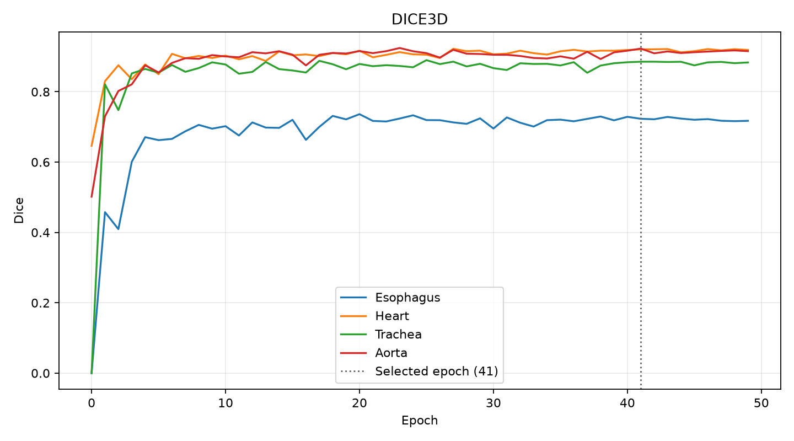
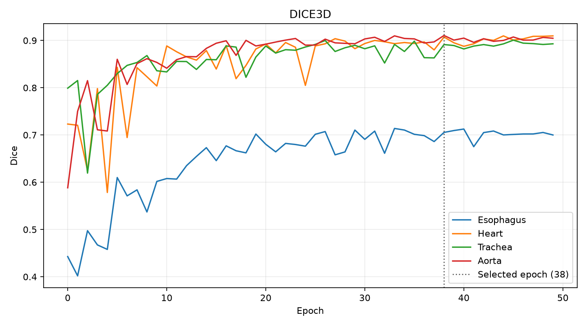

# Loss sweep: DiceCE vs NSW-DiceCE on UNet

**Setup.** `unet_k32_lr5e-4` from the [architecture sweep](../arch_sweep/sweep_report.md), 30/10 split, 50 epochs, best epoch on mean 3D Dice. 2 losses × 3 seeds; the same seed gives the same init and batch order, so runs are paired. `nswdicece` replaces the mean Dice term with $-\frac{1}{n}\sum_k \log d_k$ (= $-\log\mathrm{NSW}$). Regenerate: `job_scripts/loss_sweep.job 0 1 2`.

| Loss | 3D Dice | Eso. | Heart | Trach. | Aorta | HD95 mm | Ep. to 0.85 |
|---|---|---|---|---|---|---|---|
| `dicece` | **0.865 ± 0.002** | **0.737** | **0.918** | 0.887 | **0.919** | 20.1 | **15–18** |
| `nswdicece` | 0.853 ± 0.001 | 0.710 | 0.906 | 0.887 | 0.909 | **10.3** | 26–48 |

|  |  |
|---|---|
| `dicece`, seed 0 | `nswdicece`, seed 0 |

- **NSW is worse on every seed** (−0.009 / −0.015 / −0.013 mean 3D Dice), including on the esophagus it targets.
- **Its only win is epoch 0:** `dicece` leaves the esophagus empty in all seeds at epoch 0, while NSW segments every organ from the start. The UNet finds all organs by epoch 1 anyway, after which `dicece` converges faster and more smoothly.
- **The lower HD95 is trachea outliers only:** `dicece` produced stray blobs in 2 of 3 seeds (60 and 96 mm).

**Takeaway:** NSW helps when an organ collapses (ENet), not on a UNet where none does. We keep `dicece`.
