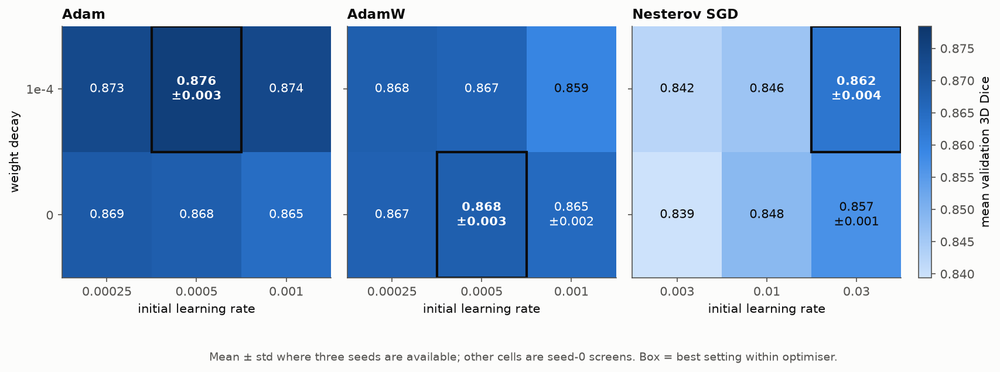
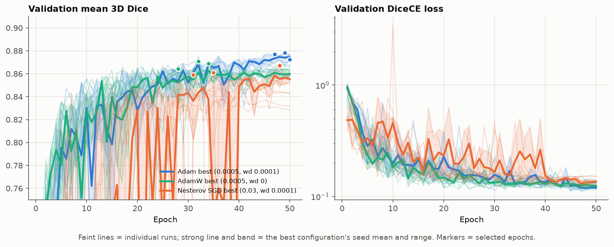
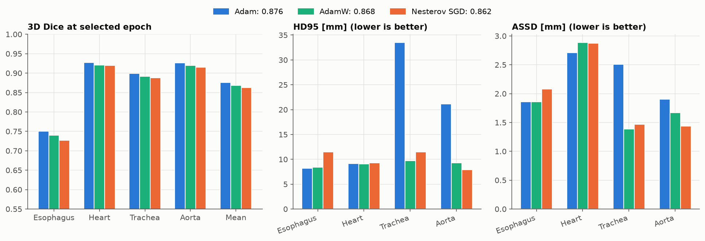

# Optimiser sweep: Adam, AdamW and Nesterov SGD

## Setup

This screen fixes the model and training recipe to **UNet k32** (7.8M parameters), full supervision, DiceCE loss, 50 epochs, and polynomial learning-rate decay. The reconstructed SegTHOR 30/10 patient split is used throughout (5,110 training and 1,793 validation slices). Mean validation 3D Dice selects the checkpoint; HD95 and ASSD are evaluated only at that checkpoint.

The initial screen contains 18 seed-0 runs: Adam, AdamW and Nesterov SGD; each with LR {2.5e-4, 5e-4, 1e-3} for Adam/AdamW or {3e-3, 1e-2, 3e-2} for SGD, crossed with weight decay {0, 1e-4}. All jobs completed successfully on A100 GPUs in about 2 h 3 min per configuration.

The top two AdamW and Nesterov-SGD settings were then repeated at seeds 1 and 2 (eight additional successful runs). The seed-0 Adam screen winner was also repeated at seeds 1 and 2 (two additional successful runs). Figures and tables aggregate these confirmed configurations as mean ± standard deviation; the other cells remain seed-0 screens.

## Summary

Adam at LR 5e-4 with weight decay 1e-4 is the confirmed winner at **0.876 ± 0.003** over three seeds. It leads confirmed AdamW (LR 5e-4, no weight decay; **0.868 ± 0.003**) by 0.008 mean 3D Dice, and confirmed Nesterov SGD (LR 3e-2, WD 1e-4; **0.862 ± 0.004**) by 0.014. The alternative AdamW setting (LR 1e-3, no weight decay) reaches 0.865 ± 0.002; the alternative SGD setting reaches 0.857 ± 0.001.

The selected Adam epochs are 47, 49 and 50 (1-indexed), so the selected metric is still improving late in training. Nesterov SGD needs its largest tested learning rate to be competitive; the two lower learning rates trail all Adam settings.

The esophagus remains the limiting structure. For the confirmed Adam winner its mean 3D Dice is 0.751, versus 0.927 (heart), 0.900 (trachea), and 0.926 (aorta). Its mean HD95 (18.0 mm) is higher than AdamW's (9.1 mm), driven by occasional trachea and aorta outliers. This means the Dice win should be paired with qualitative inspection of those predictions rather than treating HD95 as confirming the same ranking.

## Comparison with prior experiments

The direct baseline is the prior 30/10 loss sweep: UNet k32 with DiceCE, Adam, LR 5e-4 and no weight decay scored **0.865 ± 0.002** across three seeds. The confirmed regularised Adam winner improves the mean by 0.011 Dice, while AdamW is broadly consistent with the baseline and SGD is lower.

The older architecture and ENet sweeps used a different 35/5 split, so their scores are not a valid direct comparison.

## Recommendation

Use Adam, LR 5e-4, WD 1e-4 as the final optimiser recipe for this model and split. No further broad optimiser experiments are warranted.

- Inspect the high-HD95 predictions (especially trachea and aorta) before final reporting.
- If additional compute is available, test this selected recipe with a longer 75- or 100-epoch schedule; the chosen epochs are consistently late.

Any further architecture or loss comparison should use this confirmed optimiser recipe.
